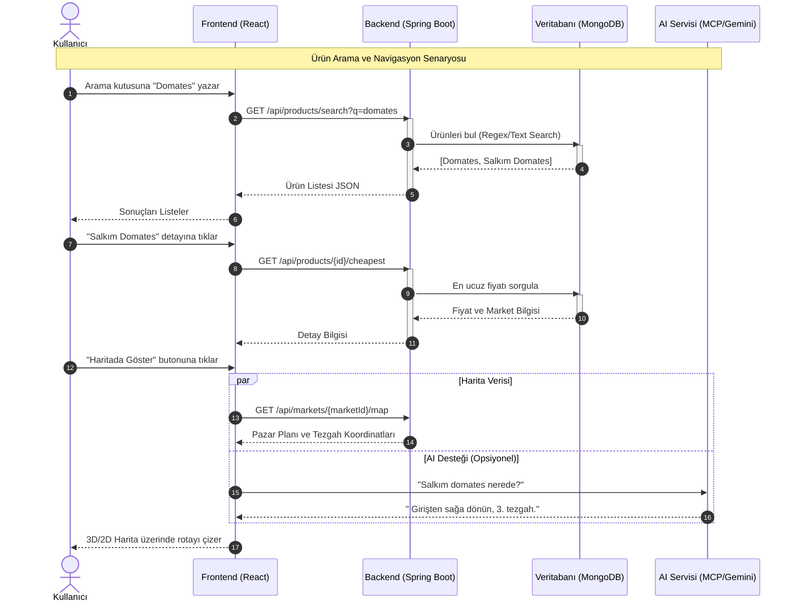

# Sistem Tasarımı ve Akış Diyagramı

Aşağıda, kullanıcının sistem üzerinden ürün araması ve seçilen ürüne navigasyon başlatması sürecini gösteren **Sequence Diagram (Sıralama Diyagramı)** yer almaktadır.

Bu diyagram **MermaidJS** formatındadır ve markdown destekleyen görüntüleyicilerde (GitHub, GitLab, VS Code vb.) otomatik olarak render edilir.

